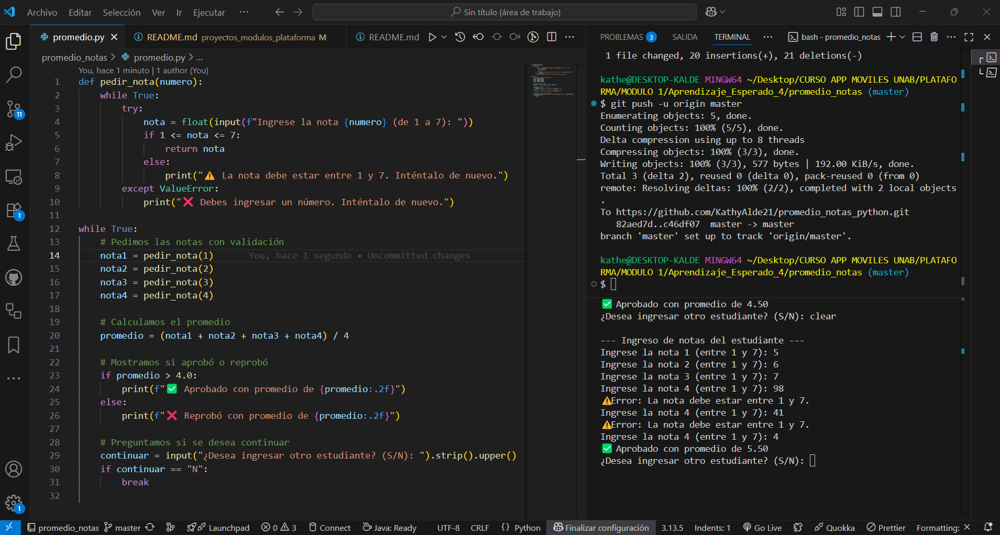

**_<h1 align="center">:vulcan_salute: Ejercicios Python: Promedio de Notas :computer:</h1>_**

**<h2 align="center">&#128203; Código realizado con ChatGPT en lenguaje Python para cumplir con requerimiento.</h2>**

 

**<h3>Actividad 2: Generación guiada de código con ChatGPT a partir de pseudocódigo</h3>**

**1. :blue_book: Contexto:**
- Una empresa de software te ha contratado para convertir sus antiguos algoritmos escritos en pseudocódigo a programas funcionales en Python.
- Para ahorrar tiempo, decides usar una herramienta de inteligencia artificial para ayudarte.

**2. :green_book: Requerimientos:**
- Se te proporciona un pseudocódigo (entregado por el docente) que calcula el promedio de cuatro notas y determina si el estudiante aprueba (promedio ≥ 4.0).
- Debes diseñar un prompt que describa este algoritmo a ChatGPT para que lo transforme en código Python.
- El código generado debe ser revisado y probado en tu entorno local o en Replit.
- Si hay errores o mejoras posibles, deben ser corregidos manualmente.

**3. :orange_book: Entregable:**
- Prompt utilizado y respuesta de ChatGPT.
- Archivo con el código funcional en Python.
- Capturas de la ejecución del código con distintos datos de entrada.
- Documento con observaciones sobre el uso de la IA y correcciones realizadas.
